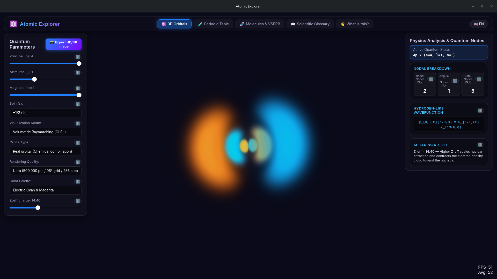
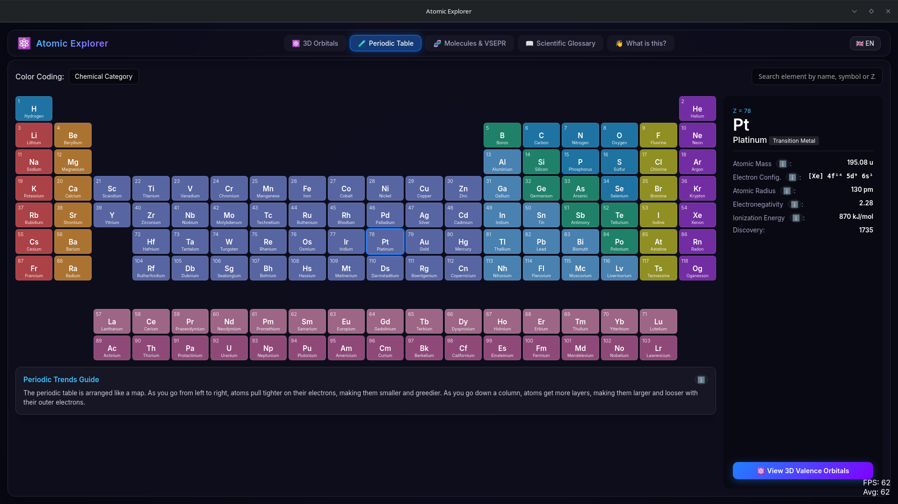

# Atomic Explorer


**Atomic Explorer** es una aplicación de escritorio para Linux diseñada para la divulgación científica. Permite a estudiantes, profesores y entusiastas de la ciencia explorar visualmente la estructura atómica en diferentes niveles de complejidad. ¡Es el equivalente a un planetario, pero para el mundo cuántico!

## ¿Qué hace la aplicación?

El mundo cuántico puede ser abstracto y difícil de imaginar. Atomic Explorer resuelve esto ofreciendo un entorno 3D interactivo donde puedes:

1. **Visualizar Orbitales Atómicos en 3D:** Observa la forma real de los orbitales atómicos (s, p, d, f) en los que residen los electrones. Podrás ver densidades de probabilidad y superficies tridimensionales usando renderizado avanzado.
2. **Explorar la Tabla Periódica Interactiva:** Navega por los 118 elementos, filtra por categorías (como metales alcalinos o gases nobles) y descubre sus propiedades periódicas, como la electronegatividad o el radio atómico.
3. **Aprender Geometría Molecular (VSEPR):** Entiende cómo se unen los átomos para formar moléculas como el agua o el metano, visualizando cómo los pares de electrones se repelen para formar estructuras lineales, tetraédricas, etc.

---

## Capturas de Pantalla

### Visualizador de Orbitales Cuánticos

*Exploración 3D de funciones de onda y orbitales atómicos.*

### Tabla Periódica Completa

*Acceso a toda la información de los elementos y sus configuraciones.*

### Geometría y Moléculas

*Visualización de hibridación y modelos de repulsión de pares de electrones (VSEPR).*

---

## Requisitos de Hardware

La aplicación realiza cálculos matemáticos complejos y renderizado 3D en tiempo real (WebGL), por lo que se recomienda el siguiente hardware para un rendimiento óptimo:

- **Sistema Operativo:** GNU/Linux (Ubuntu 22.04+, Debian 12+, Fedora, u otras distribuciones modernas). Soporte nativo para X11 y Wayland.
- **Procesador (CPU):** Procesador moderno multi-núcleo (Intel Core i3 / AMD Ryzen 3 o superior).
- **Memoria (RAM):** 4 GB de RAM (se recomiendan 8 GB para una experiencia fluida).
- **Tarjeta Gráfica (GPU):** Acelerador gráfico con soporte para WebGL. Tarjetas integradas modernas (Intel HD, AMD Vega) o dedicadas (NVIDIA, AMD) son compatibles.

---

## Cómo Instalar y Probar la Aplicación

Atomic Explorer se distribuye en formatos empaquetados para que no tengas que compilar nada. Puedes encontrar los instaladores generados en los directorios de la aplicación o en las futuras "Releases" del proyecto.

### Opción 1: Usando AppImage (Recomendado, no requiere instalación)
El formato AppImage es universal y funciona en casi cualquier distribución Linux sin necesidad de instalar dependencias adicionales en el sistema.

1. Descarga el archivo `.AppImage` (por ejemplo, `atomic-explorer_0.1.0_amd64.AppImage`).
2. Dale permisos de ejecución. Puedes hacerlo desde las propiedades del archivo (clic derecho -> Propiedades -> Permisos -> Permitir ejecutar), o usando la terminal:
   ```bash
   chmod +x atomic-explorer_0.1.0_amd64.AppImage
   ```
3. ¡Haz doble clic en el archivo para abrir la aplicación!

### Opción 2: Paquete Debian (.deb)
Para distribuciones como Ubuntu, Debian, Linux Mint, Pop!_OS, etc.

1. Descarga el archivo `.deb` (por ejemplo, `atomic-explorer_0.1.0_amd64.deb`).
2. Haz doble clic en él para abrirlo con el Centro de Software e instalarlo, o instálalo desde la terminal:
   ```bash
   sudo apt install ./atomic-explorer_0.1.0_amd64.deb
   ```
3. Una vez instalado, busca "Atomic Explorer" en tu menú de aplicaciones.

### Opción 3: Paquete RPM (.rpm)
Para distribuciones como Fedora, openSUSE, RHEL, CentOS, etc.

1. Descarga el archivo `.rpm` (por ejemplo, `atomic-explorer-0.1.0-1.x86_64.rpm`).
2. Instálalo usando tu gestor de paquetes gráfico, o mediante la terminal:
   ```bash
   sudo dnf install ./atomic-explorer-0.1.0-1.x86_64.rpm
   ```
3. Busca "Atomic Explorer" en tu menú de aplicaciones.
