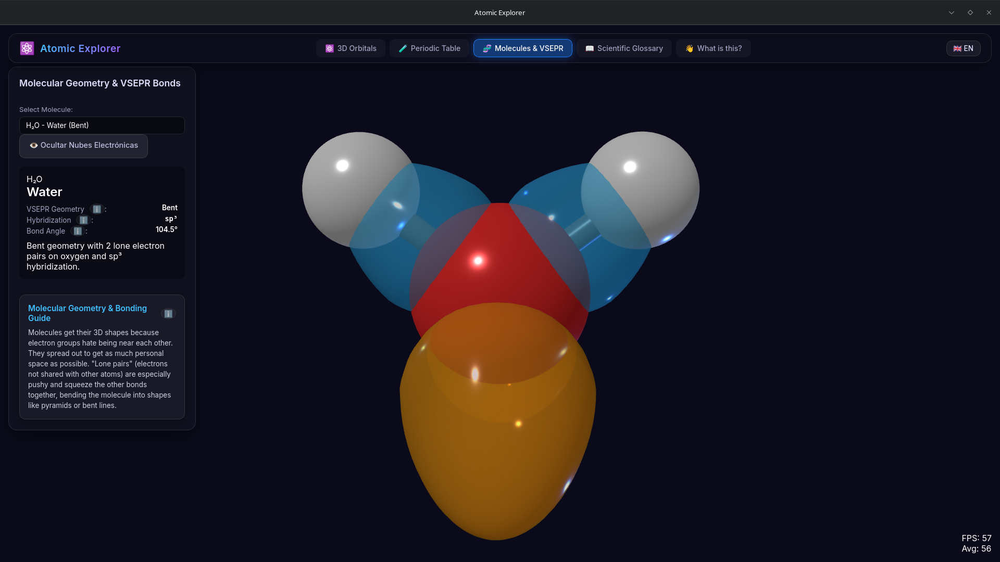

# Atomic Explorer


**Atomic Explorer** is an interactive science popularization application available on the web and as a desktop application for Linux. It allows students, teachers, and science enthusiasts to visually explore the atomic structure at different levels of complexity. It's the equivalent of a planetarium, but for the quantum world!

> 🌐 **Try it Live in your Browser:** [https://arrase.github.io/atomic-explorer/](https://arrase.github.io/atomic-explorer/)

## What does the application do?

The quantum world can be abstract and difficult to imagine. Atomic Explorer solves this by offering an interactive 3D environment where you can:

1. **Visualize Atomic Orbitals in 3D:** Observe the actual shape of atomic orbitals (s, p, d, f) where electrons reside. You can view probability densities and three-dimensional surfaces using advanced rendering.
2. **Explore the Interactive Periodic Table:** Navigate through the 118 elements, filter by categories (such as alkali metals or noble gases), and discover their periodic properties, such as electronegativity or atomic radius.
3. **Learn Molecular Geometry (VSEPR):** Understand how atoms bond to form molecules like water or methane, visualizing how electron pairs repel each other to form linear, tetrahedral structures, etc.

---

## Screenshots

### Quantum Orbital Visualizer

*3D exploration of wave functions and atomic orbitals.*

### Complete Periodic Table

*Access to all element information and configurations.*

### Geometry and Molecules

*Visualization of hybridization and valence shell electron pair repulsion (VSEPR) models.*

---

## Hardware Requirements

The application performs complex mathematical calculations and real-time 3D rendering (WebGL), so the following hardware is recommended for optimal performance:

- **Operating System:** GNU/Linux (Ubuntu 22.04+, Debian 12+, Fedora, or other modern distributions). Native support for X11 and Wayland.
- **Processor (CPU):** Modern multi-core processor (Intel Core i3 / AMD Ryzen 3 or higher).
- **Memory (RAM):** 4 GB of RAM (8 GB recommended for a smooth experience).
- **Graphics Card (GPU):** Graphics accelerator with WebGL support. Modern integrated cards (Intel HD, AMD Vega) or dedicated (NVIDIA, AMD) are supported.

---

## How to Install and Test the Application

### Option 1: Web Version (Instant access, no installation required)
You can try the application directly in your browser without installing anything:
👉 **[https://arrase.github.io/atomic-explorer/](https://arrase.github.io/atomic-explorer/)**

For desktop installation on Linux, you can download the pre-compiled packages in the **Releases** tab of this GitHub repository:

### Option 2: Using AppImage (Recommended Linux executable)
The AppImage format works on almost any Linux distribution without installing anything on the system.

1. Go to the **Releases** section of this repository and download the `.AppImage` file corresponding to the latest version (example: `atomic-explorer_0.1.0_amd64.AppImage`).
2. Give it execution permissions. You can do this from the file properties in your file manager (right click -> *Properties* -> *Permissions* -> *Allow executing file as program*), or from the terminal:
   ```bash
   chmod +x atomic-explorer_0.1.0_amd64.AppImage
   ```
3. Double-click the downloaded file to launch the application.

### Option 2: Debian Package (.deb)
For distributions like Ubuntu, Debian, Linux Mint, Pop!_OS, Zorin OS, etc.

1. Download the `.deb` package from the **Releases** section (example: `atomic-explorer_0.1.0_amd64.deb`).
2. Double-click the file to install it with your system's Software Center, or run in the terminal:
   ```bash
   sudo apt install ./atomic-explorer_0.1.0_amd64.deb
   ```
3. Open "Atomic Explorer" from the system application menu.

### Option 3: RPM Package (.rpm)
For distributions like Fedora, openSUSE, RHEL, Rocky Linux, CentOS, etc.

1. Download the `.rpm` package from the **Releases** section (example: `atomic-explorer-0.1.0-1.x86_64.rpm`).
2. Install it from the terminal by running:
   ```bash
   sudo dnf install ./atomic-explorer-0.1.0-1.x86_64.rpm
   ```
3. Launch the application from the system menu.

---

## Publishing New Versions (For Maintainers)

This repository has an automated **GitHub Action** to generate and upload the installers (`AppImage`, `.deb`, `.rpm`) to GitHub Releases automatically when creating a new version.

To publish a new Release:

1. Create and push a tag with the version (e.g. `v0.1.0`):
   ```bash
   git tag v0.1.0
   git push origin v0.1.0
   ```
2. The `.github/workflows/release.yml` action will automatically compile the WASM math engine, build the Tauri packages, and publish the release on GitHub with all attached installers.

