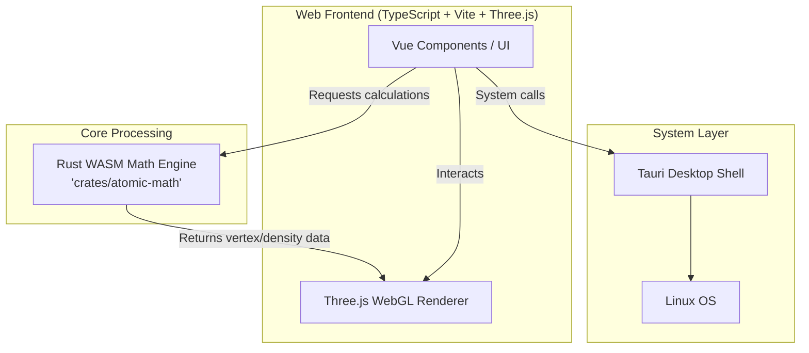

# Architecture

Atomic Explorer is built on a modern, high-performance tech stack leveraging web technologies for the UI and system-level languages for computation and desktop integration.

## Core Components

- **Tauri**: Provides desktop packaging and system APIs. It creates a lightweight native shell around our web application for deep Linux integration.
- **Rust (WASM Math Engine)**: The heavy mathematical lifting, especially the quantum mechanics equations and orbital probability densities, are calculated by our Rust crate `crates/atomic-math` compiled to WebAssembly (WASM).
- **TypeScript + Vite + Three.js**: The frontend leverages TypeScript for type safety, Vite for fast development builds, Vue for UI components, and Three.js (WebGL) for real-time 3D rendering of orbitals and molecules.

## Architecture Diagram

