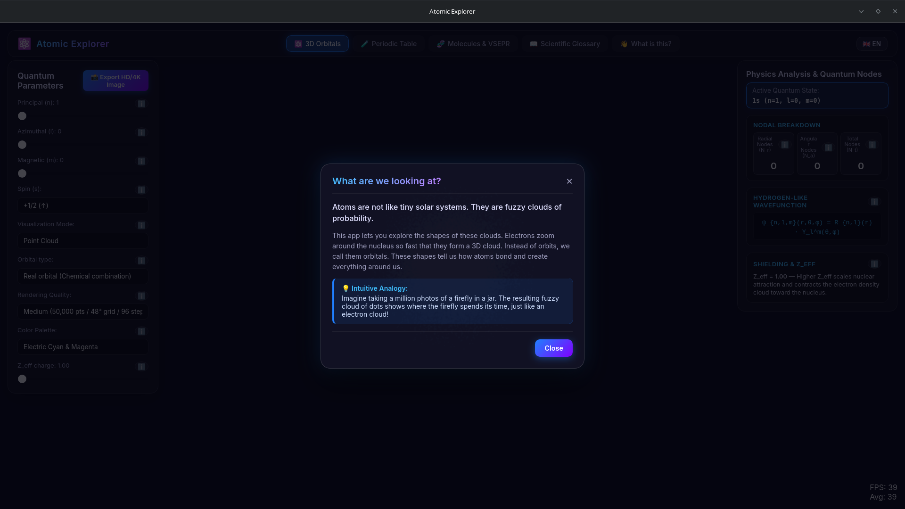

# Atomic Explorer

> A desktop application for Linux designed for science popularization.

## Key Features

  
<i class="fa-solid fa-atom"></i> <strong>Quantum Orbital Visualizer</strong>

  
<i class="fa-solid fa-table"></i> <strong>Interactive Periodic Table</strong>

  
<i class="fa-solid fa-cubes"></i> <strong>Molecular Geometry (VSEPR)</strong>

## Documentation

  <a href="architecture.md" class="feature-card">
    <h3>Architecture</h3>
    
Discover the core components: Tauri, Rust WASM Math Engine, and Vite + Three.js rendering.

  </a>
  <a href="features.md" class="feature-card">
    <h3>Features</h3>
    
Dive deep into Quantum Orbitals, Periodic Table, and Molecular Modeling.

  </a>
  <a href="installation.md" class="feature-card">
    <h3>Installation</h3>
    
Learn how to install Atomic Explorer on your Linux system.

  </a>
  <a href="releasing.md" class="feature-card">
    <h3>Releasing</h3>
    
Instructions for building and releasing new versions.

  </a>

